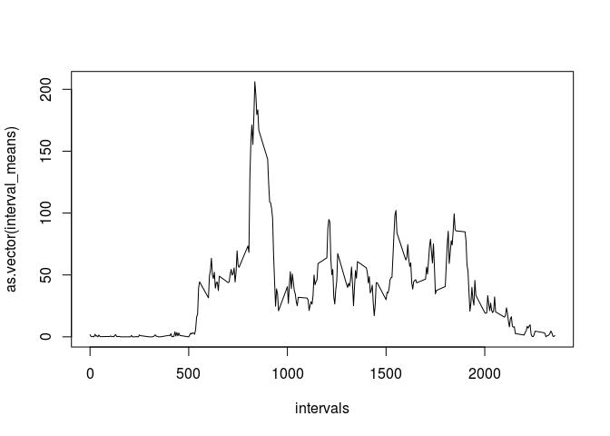

## Loading and preprocessing the data
1. Reading in data

```r
raw_data<-read.csv(unz("activity.zip","activity.csv"),colClasses = c('integer','character','integer'))
```
2. Creating a dataset without na's

```r
comp_data_bool<-complete.cases(raw_data)
comp_data<-raw_data[comp_data_bool,]
```

## What is mean total number of steps taken per day?
1. Calculating totals per day...

```r
dates<-as.vector(as.matrix(unique(comp_data["date"])))
daily_tots<-sapply(dates,function(x) sapply(comp_data[comp_data$date==x,]["steps"],sum))
#Barplot
barplot(as.vector(daily_tots), main="Total steps per Day")
```


```r
#Mean and median of totals
print(mean(daily_tots))
```

```
## [1] 10766.19
```

```r
print(median(daily_tots))
```

```
## [1] 10765
```

## What is the average daily activity pattern?
1. Calculating average steps per time interval

```r
intervals<-as.vector(as.matrix(unique(comp_data["interval"])))
interval_means<-sapply(intervals,function(x) sapply(comp_data[comp_data$interval==x,]["steps"],mean))
plot(intervals,as.vector(interval_means),type='l')
```


2. Time-series plot of average steps taken per interval

```r
plot(intervals,as.vector(interval_means),type='l')
max_avg<-max(interval_means)
max_int<-match(max_avg,interval_means)
points(intervals[max_int],max_avg,col='red')
```


```r
paste("The interval that has the largest average number of steps is",intervals[max_int],"and is indicated by the red dot at",max_avg,sep=' ')
```

```
## [1] "The interval that has the largest average number of steps is 835 and is indicated by the red dot at 206.169811320755"
```
## Inputing missing values
1. Finding the number of rows with NAs in them. Remember, comp_data is data-NA rows.

```r
num_NAs<-sum(!comp_data_bool)
paste("From the raw data, ",num_NAs," records had missing values",sep='')
```

```
## [1] "From the raw data, 2304 records had missing values"
```
2. Strategy for filling in missing data  
  1. If no missing values, leave be.  
  2. If missing value, mean of all available values of that time step.  

3. Applying strategy to create new dataset.

```r
new.steps<-c()
new.date<-raw_data$date
new.interval<-raw_data$interval
for (s in raw_data$steps) {
  if (is.na(s)) {
    new.steps<-c(new.steps,interval_means[match(s,raw_data$steps)])
  }
  else {
    new.steps<-c(new.steps,s)
  }
}
new.data<-data.frame(new.steps,new.date,new.interval)
colnames(new.data)<-c("steps","date","interval")
```

Histogram that displays **total** steps per day. Reporting mean and median of total steps per day.

```r
all.days<-dimnames(table(new.data$date))[[1]]
new.totals<-c()
for (d in all.days){
  tempdf<-new.data[new.data$date==d,]
  s<-sum(tempdf$steps)
  new.totals<-c(new.totals,s)
}
#...and mean and median!
new.tot_mean<-mean(new.totals)
new.tot_median<-median(new.totals)

#barplot
barplot(new.totals)
abline(h=new.tot_mean, col="red")
abline(h=new.tot_median, col="blue")
```


What is the impact?

```r
print(mean(daily_tots))
```

```
## [1] 10766.19
```

```r
print(median(daily_tots))
```

```
## [1] 10765
```

```r
print(new.tot_mean)
```

```
## [1] 9419.081
```

```r
print(new.tot_median)
```

```
## [1] 10395
```
Both Mean and Median have changed, though median hasn't been as largely affected (mean dropped by ~1300, while median dropped by 360)

## Are there differences in activity patterns between weekdays and weekends?
1. Factor variable if day is weekday or weekend

```r
date<-as.POSIXct(new.data$date)
week<-c("Monday","Tuesday","Wednesday","Thursday","Friday")
is.weekday<-weekdays(date) %in%  week
```
2. panel plot [time series average steps taken by interval, by factor variable]

```r
new.avg_steps<-c()
for (i in new.interval){
  tempdf<-new.data[new.data$interval==i,]
  s<-mean(tempdf$steps)
  new.avg_steps<-c(new.avg_steps,s)
}

par(mfrow=c(2,1))
plot(subset(new.interval,is.weekday),subset(new.avg_steps,is.weekday),type='l',xlab="Weekday",ylab="Avg. steps taken")
plot(subset(new.interval,!is.weekday),subset(new.avg_steps,!is.weekday),type='l', xlab="Weekend",ylab="Avg. steps taken")
```


