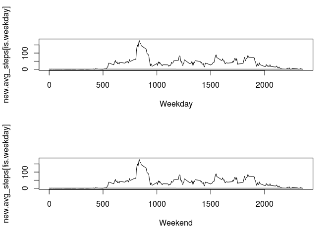

# Reproducible Research: Peer Assessment 1


## Loading and preprocessing the data
1. Reading in data

```r
data<-read.csv(unz("activity.zip","activity.csv"))
```
2. Creating a dataset without na's

```r
comp_data_bool<-complete.cases(data)
comp_data<-data[comp_data_bool,]
```

## What is mean total number of steps taken per day?
1. Calculating totals per day...

```r
days<-dimnames(table(comp_data$date))[[1]]
totals<-c()
for (d in days){
  tempdf<-comp_data[comp_data$date==d,]
  s<-sum(tempdf$steps)
  totals<-c(totals,s)
}
#...and mean and median!
tot_mean<-mean(totals)
tot_median<-median(totals)
```
2. graphing total steps vs. days

```r
barplot(totals)
#adding a line that represents the mean and median per day steps
abline(h=tot_mean,col="red")
abline(h=tot_median,col="blue")
```

 

## What is the average daily activity pattern?
1. Calculating average steps per time interval

```r
intervals<-dimnames(table(comp_data$interval))[[1]]
avg_steps<-c()
for (i in intervals){
  tempdf<-comp_data[comp_data$interval==i,]
  s<-mean(tempdf$steps)
  avg_steps<-c(avg_steps,s)
}
```
2. Time-series plot of average steps taken per interval

```r
plot(intervals, avg_steps,type="l")
max_avg<-max(avg_steps)
max_int<-match(max_avg,avg_steps)
points(intervals[max_int],max_avg,col="red", pch=21)
```

 

```r
paste("The interval that has the largest average number of steps is",intervals[max_int],"and is indicated by the red dot at",max_avg,sep=' ')
```

```
## [1] "The interval that has the largest average number of steps is 835 and is indicated by the red dot at 206.169811320755"
```
## Inputing missing values
1. Finding the number of rows with NAs in them. Remember, comp_data is data-NA rows.

```r
num.na.rows<-length(row.names(data))-length(row.names(comp_data))
print(num.na.rows)
```

```
## [1] 2304
```
2. Strategy for filling in missing data  
  1. If no missing values, leave be.  
  2. If missing value, mean of all available values of that time step.  

3. Applying strategy to create new dataset.

```r
new.steps<-c()
new.date<-data$date
new.interval<-data$interval
for (s in data$steps) {
  if (is.na(s)) {
    new.steps<-c(new.steps,avg_steps[match(s,data$steps)])
  }
  else {
    new.steps<-c(new.steps,s)
  }
}
new.data<-data.frame(new.steps,new.date,new.interval)
colnames(new.data)<-c("steps","date","interval")
```

Histogram that displays **total** steps per day. Reporting mean and median of total steps per day.

```r
all.days<-dimnames(table(new.data$date))[[1]]
new.totals<-c()
for (d in all.days){
  tempdf<-new.data[new.data$date==d,]
  s<-sum(tempdf$steps)
  new.totals<-c(new.totals,s)
}
#...and mean and median!
new.tot_mean<-mean(new.totals)
new.tot_median<-median(new.totals)

#barplot
barplot(new.totals)
abline(h=new.tot_mean, col="red")
abline(h=new.tot_median, col="blue")
```

 

What is the impact?

```r
print(tot_mean)
```

```
## [1] 9354.23
```

```r
print(tot_median)
```

```
## [1] 10395
```

```r
print(new.tot_mean)
```

```
## [1] 9419.081
```

```r
print(new.tot_median)
```

```
## [1] 10395
```
Median hasn't changed (by adding the mean, median doesn't change). However the mean has increased

## Are there differences in activity patterns between weekdays and weekends?
1. Factor variable if day is weekday or weekend

```r
date<-as.POSIXct(data$date)
week<-c("Monday","Tuesday","Wednesday","Thursday","Friday")

is.weekday<-weekdays(date) %in%  week
```
2. panel plot [time series average steps taken by interval, by factor variable]

```r
library(fields)
```

```
## Loading required package: spam
## Loading required package: grid
## Spam version 1.0-1 (2014-09-09) is loaded.
## Type 'help( Spam)' or 'demo( spam)' for a short introduction 
## and overview of this package.
## Help for individual functions is also obtained by adding the
## suffix '.spam' to the function name, e.g. 'help( chol.spam)'.
## 
## Attaching package: 'spam'
## 
## The following objects are masked from 'package:base':
## 
##     backsolve, forwardsolve
## 
## Loading required package: maps
```

```r
new.avg_steps<-c()
for (i in new.interval){
  tempdf<-new.data[new.data$interval==i,]
  s<-mean(tempdf$steps)
  new.avg_steps<-c(new.avg_steps,s)
}

set.panel(2,1)
```

```
## plot window will lay out plots in a 2 by 1 matrix
```

```r
plot(new.interval[is.weekday],new.avg_steps[is.weekday],type='l',xlab="Weekday")
plot(new.interval[!is.weekday],new.avg_steps[!is.weekday],type='l', xlab="Weekend")
```

 
